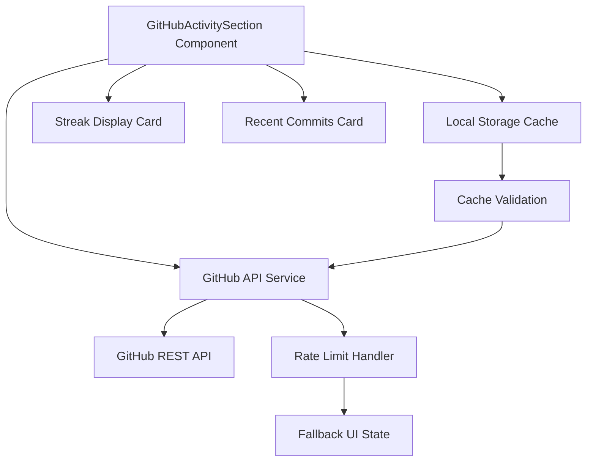
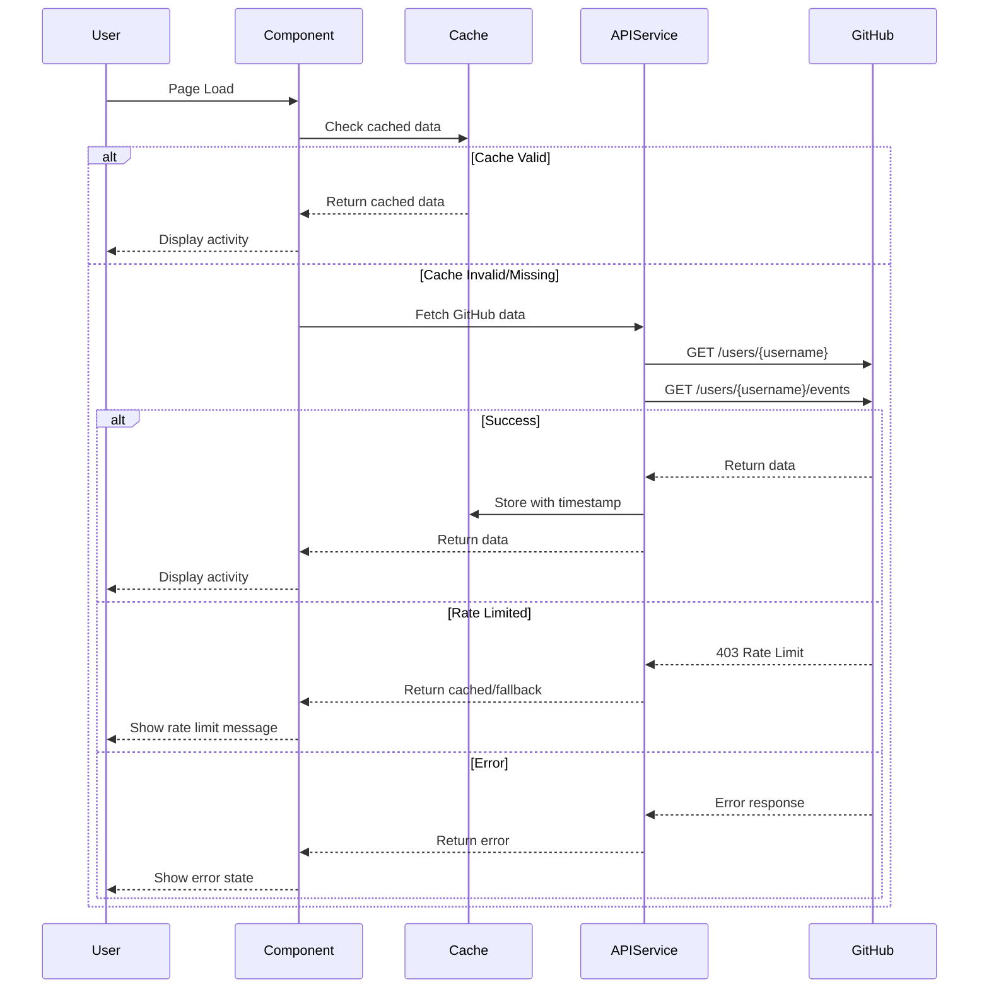

# Design Document: GitHub Activity Display

## Overview

This feature integrates GitHub API to display user activity metrics (contribution streak and recent commits) in the portfolio application. The component will be designed as a new standalone section that fits seamlessly into the existing dark/terminal aesthetic, positioned between the SkillsSection and LiveSection. It will handle API rate limits gracefully, cache responses client-side, and provide fallback UI states for loading and error scenarios.

## Architecture



## Main Algorithm/Workflow



## Components and Interfaces

### Component 1: GitHubActivitySection

**Purpose**: Main section component that orchestrates data fetching and displays GitHub activity metrics

**Interface**:
```typescript
interface GitHubActivitySectionProps {
  username: string;
  className?: string;
}
```

**Responsibilities**:
- Fetch GitHub activity data on mount
- Manage loading, error, and success states
- Render streak and commits cards
- Handle cache invalidation
- Coordinate with API service

### Component 2: StreakCard

**Purpose**: Displays contribution streak information with visual indicators

**Interface**:
```typescript
interface StreakCardProps {
  currentStreak: number;
  longestStreak: number;
  totalContributions: number;
  isLoading?: boolean;
}
```

**Responsibilities**:
- Display current and longest streak metrics
- Show total contributions count
- Animate numbers on load
- Match terminal aesthetic

### Component 3: RecentCommitsCard

**Purpose**: Displays list of recent commits with repository context

**Interface**:
```typescript
interface RecentCommitsCardProps {
  commits: CommitInfo[];
  isLoading?: boolean;
}

interface CommitInfo {
  sha: string;
  message: string;
  repo: string;
  timestamp: string;
  url: string;
}
```

**Responsibilities**:
- Display up to 5 recent commits
- Format commit messages (truncate if needed)
- Show relative timestamps
- Provide links to commits on GitHub

### Component 4: GitHubAPIService

**Purpose**: Service layer for GitHub API interactions with rate limit handling

**Interface**:
```typescript
interface GitHubAPIService {
  fetchUserActivity(username: string): Promise<GitHubActivityData>;
  checkRateLimit(): Promise<RateLimitInfo>;
}

interface GitHubActivityData {
  streak: StreakData;
  commits: CommitInfo[];
  rateLimit: RateLimitInfo;
}

interface StreakData {
  currentStreak: number;
  longestStreak: number;
  totalContributions: number;
}

interface RateLimitInfo {
  remaining: number;
  limit: number;
  resetAt: string;
}
```

**Responsibilities**:
- Make authenticated/unauthenticated API calls
- Parse GitHub API responses
- Handle rate limiting (403 responses)
- Calculate streak from contribution data
- Extract recent commits from events API

## Data Models

### Model 1: GitHubActivityData

```typescript
interface GitHubActivityData {
  streak: StreakData;
  commits: CommitInfo[];
  rateLimit: RateLimitInfo;
  cachedAt?: number; // Unix timestamp
}
```

**Validation Rules**:
- `streak.currentStreak` must be >= 0
- `streak.longestStreak` must be >= currentStreak
- `commits` array max length of 5
- `cachedAt` must be valid Unix timestamp if present

### Model 2: CacheEntry

```typescript
interface CacheEntry<T> {
  data: T;
  timestamp: number;
  expiresIn: number; // milliseconds
}
```

**Validation Rules**:
- `timestamp` must be valid Unix timestamp
- `expiresIn` must be positive integer
- Cache is valid if `Date.now() - timestamp < expiresIn`

### Model 3: APIError

```typescript
interface APIError {
  type: 'rate_limit' | 'network' | 'not_found' | 'unknown';
  message: string;
  retryAfter?: number; // seconds
}
```

**Validation Rules**:
- `type` must be one of defined error types
- `message` must be non-empty string
- `retryAfter` only present for rate_limit type

## Core Interfaces/Types

```typescript
// Main component props
interface GitHubActivitySectionProps {
  username: string;
  className?: string;
}

// API response types
interface GitHubUser {
  login: string;
  public_repos: number;
  followers: number;
  created_at: string;
}

interface GitHubEvent {
  id: string;
  type: string;
  repo: {
    name: string;
    url: string;
  };
  payload: {
    commits?: Array<{
      sha: string;
      message: string;
    }>;
  };
  created_at: string;
}

// Processed data types
interface StreakData {
  currentStreak: number;
  longestStreak: number;
  totalContributions: number;
}

interface CommitInfo {
  sha: string;
  message: string;
  repo: string;
  timestamp: string;
  url: string;
}

interface RateLimitInfo {
  remaining: number;
  limit: number;
  resetAt: string;
}

interface GitHubActivityData {
  streak: StreakData;
  commits: CommitInfo[];
  rateLimit: RateLimitInfo;
  cachedAt?: number;
}

// Cache management
interface CacheEntry<T> {
  data: T;
  timestamp: number;
  expiresIn: number;
}

// Error handling
interface APIError {
  type: 'rate_limit' | 'network' | 'not_found' | 'unknown';
  message: string;
  retryAfter?: number;
}
```

## Key Functions with Formal Specifications

### Function 1: fetchUserActivity()

```typescript
async function fetchUserActivity(username: string): Promise<GitHubActivityData>
```

**Preconditions:**
- `username` is non-empty string
- `username` contains only valid GitHub username characters (alphanumeric, hyphens)
- Network connection is available

**Postconditions:**
- Returns valid `GitHubActivityData` object on success
- Throws `APIError` with appropriate type on failure
- Rate limit info is always populated in response
- Commits array contains max 5 items
- All timestamps are valid ISO 8601 strings

**Loop Invariants:** N/A (async function with sequential API calls)

### Function 2: calculateStreak()

```typescript
function calculateStreak(events: GitHubEvent[]): StreakData
```

**Preconditions:**
- `events` is a valid array (may be empty)
- Each event has valid `created_at` timestamp
- Events are sorted by date (newest first)

**Postconditions:**
- Returns `StreakData` with all fields >= 0
- `longestStreak >= currentStreak` always true
- `totalContributions` equals count of contribution events
- Current streak is 0 if no activity in last 24 hours

**Loop Invariants:**
- During iteration: all processed dates are in chronological order
- Streak counter never becomes negative
- Total contributions count increases monotonically

### Function 3: getCachedData()

```typescript
function getCachedData<T>(key: string): T | null
```

**Preconditions:**
- `key` is non-empty string
- localStorage is available in browser

**Postconditions:**
- Returns cached data if valid and not expired
- Returns `null` if cache miss, expired, or invalid
- No side effects on cache storage
- Never throws errors (catches and returns null)

**Loop Invariants:** N/A (no loops)

### Function 4: setCachedData()

```typescript
function setCachedData<T>(key: string, data: T, expiresIn: number): void
```

**Preconditions:**
- `key` is non-empty string
- `data` is serializable to JSON
- `expiresIn` is positive integer (milliseconds)
- localStorage is available

**Postconditions:**
- Data is stored in localStorage with timestamp
- Cache entry includes expiration time
- Previous cache entry (if any) is overwritten
- Throws error if localStorage quota exceeded

**Loop Invariants:** N/A (no loops)

## Algorithmic Pseudocode

### Main Data Fetching Algorithm

```typescript
async function fetchGitHubActivity(username: string): Promise<GitHubActivityData> {
  // PRECONDITION: username is valid non-empty string
  
  // Step 1: Check cache first
  const cached = getCachedData<GitHubActivityData>(`github_${username}`);
  if (cached !== null) {
    return cached;
  }
  
  // Step 2: Fetch user data and events in parallel
  try {
    const [userResponse, eventsResponse, rateLimitResponse] = await Promise.all([
      fetch(`https://api.github.com/users/${username}`),
      fetch(`https://api.github.com/users/${username}/events?per_page=100`),
      fetch(`https://api.github.com/rate_limit`)
    ]);
    
    // Step 3: Check for rate limiting
    if (userResponse.status === 403 || eventsResponse.status === 403) {
      const rateLimitData = await rateLimitResponse.json();
      throw new APIError({
        type: 'rate_limit',
        message: 'GitHub API rate limit exceeded',
        retryAfter: calculateRetryAfter(rateLimitData.rate.reset)
      });
    }
    
    // Step 4: Parse responses
    const user: GitHubUser = await userResponse.json();
    const events: GitHubEvent[] = await eventsResponse.json();
    const rateLimit = await rateLimitResponse.json();
    
    // Step 5: Process data
    const streak = calculateStreak(events);
    const commits = extractRecentCommits(events, 5);
    
    // Step 6: Build result
    const result: GitHubActivityData = {
      streak,
      commits,
      rateLimit: {
        remaining: rateLimit.rate.remaining,
        limit: rateLimit.rate.limit,
        resetAt: new Date(rateLimit.rate.reset * 1000).toISOString()
      },
      cachedAt: Date.now()
    };
    
    // Step 7: Cache result (15 minutes)
    setCachedData(`github_${username}`, result, 15 * 60 * 1000);
    
    return result;
    
  } catch (error) {
    if (error instanceof APIError) {
      throw error;
    }
    throw new APIError({
      type: 'network',
      message: 'Failed to fetch GitHub data'
    });
  }
  
  // POSTCONDITION: Returns valid GitHubActivityData or throws APIError
}
```

**Preconditions:**
- `username` is valid GitHub username
- Network is available
- GitHub API is accessible

**Postconditions:**
- Returns complete `GitHubActivityData` on success
- Data is cached for 15 minutes
- Throws typed `APIError` on failure
- Rate limit info is always included

**Loop Invariants:** N/A (uses Promise.all for parallel requests)

### Streak Calculation Algorithm

```typescript
function calculateStreak(events: GitHubEvent[]): StreakData {
  // PRECONDITION: events is valid array, sorted newest first
  
  let currentStreak = 0;
  let longestStreak = 0;
  let tempStreak = 0;
  let totalContributions = 0;
  let lastDate: Date | null = null;
  
  // Filter contribution events
  const contributionEvents = events.filter(e => 
    e.type === 'PushEvent' || 
    e.type === 'PullRequestEvent' || 
    e.type === 'IssuesEvent'
  );
  
  totalContributions = contributionEvents.length;
  
  // LOOP INVARIANT: tempStreak >= 0, longestStreak >= tempStreak
  for (const event of contributionEvents) {
    const eventDate = new Date(event.created_at);
    eventDate.setHours(0, 0, 0, 0); // Normalize to day
    
    if (lastDate === null) {
      // First event
      tempStreak = 1;
      currentStreak = isToday(eventDate) || isYesterday(eventDate) ? 1 : 0;
    } else {
      const dayDiff = Math.floor((lastDate.getTime() - eventDate.getTime()) / (1000 * 60 * 60 * 24));
      
      if (dayDiff === 1) {
        // Consecutive day
        tempStreak++;
        if (currentStreak > 0) currentStreak++;
      } else if (dayDiff > 1) {
        // Streak broken
        longestStreak = Math.max(longestStreak, tempStreak);
        tempStreak = 1;
      }
      // dayDiff === 0 means same day, don't increment
    }
    
    lastDate = eventDate;
    // ASSERT: tempStreak > 0 && longestStreak >= 0
  }
  
  longestStreak = Math.max(longestStreak, tempStreak);
  
  return {
    currentStreak,
    longestStreak,
    totalContributions
  };
  
  // POSTCONDITION: longestStreak >= currentStreak >= 0
}
```

**Preconditions:**
- `events` is valid array (may be empty)
- Events have valid `created_at` timestamps
- Events are sorted newest first

**Postconditions:**
- Returns `StreakData` with all non-negative values
- `longestStreak >= currentStreak` always holds
- `currentStreak` is 0 if no recent activity
- `totalContributions` equals filtered event count

**Loop Invariants:**
- `tempStreak >= 0` throughout iteration
- `longestStreak >= tempStreak` at loop end
- `lastDate` is always normalized to midnight
- Processed events maintain chronological order

### Cache Retrieval Algorithm

```typescript
function getCachedData<T>(key: string): T | null {
  // PRECONDITION: key is non-empty string
  
  try {
    const item = localStorage.getItem(key);
    
    if (item === null) {
      return null;
    }
    
    const cacheEntry: CacheEntry<T> = JSON.parse(item);
    const now = Date.now();
    
    // Check if expired
    if (now - cacheEntry.timestamp > cacheEntry.expiresIn) {
      localStorage.removeItem(key);
      return null;
    }
    
    return cacheEntry.data;
    
  } catch (error) {
    // Invalid JSON or localStorage error
    return null;
  }
  
  // POSTCONDITION: Returns valid data or null, never throws
}
```

**Preconditions:**
- `key` is non-empty string
- localStorage API is available

**Postconditions:**
- Returns cached data if valid and not expired
- Returns `null` for cache miss or expired data
- Removes expired entries from storage
- Never throws errors (catches all exceptions)

**Loop Invariants:** N/A (no loops)

## Example Usage

```typescript
// Example 1: Basic component usage in page
import GitHubActivitySection from '@/components/home/GitHubActivitySection';

export default function Home() {
  return (
    <main>
      <HomeHero />
      <SkillsSection />
      <GitHubActivitySection username="yourusername" />
      <LiveSection />
      <MotivationSection />
      <FaqSection />
    </main>
  );
}

// Example 2: Component with error handling
'use client';

export default function GitHubActivitySection({ username }: { username: string }) {
  const [data, setData] = useState<GitHubActivityData | null>(null);
  const [error, setError] = useState<APIError | null>(null);
  const [loading, setLoading] = useState(true);
  
  useEffect(() => {
    fetchGitHubActivity(username)
      .then(setData)
      .catch(setError)
      .finally(() => setLoading(false));
  }, [username]);
  
  if (loading) return <LoadingState />;
  if (error) return <ErrorState error={error} />;
  if (!data) return null;
  
  return (
    <section className="bg-black text-white px-6 py-20">
      <StreakCard {...data.streak} />
      <RecentCommitsCard commits={data.commits} />
    </section>
  );
}

// Example 3: API service usage
const apiService = new GitHubAPIService();

// Fetch with automatic caching
const activity = await apiService.fetchUserActivity('octocat');

// Check rate limit before making requests
const rateLimit = await apiService.checkRateLimit();
if (rateLimit.remaining < 10) {
  console.warn('Approaching rate limit');
}

// Example 4: Manual cache management
import { getCachedData, setCachedData } from '@/lib/cache';

// Store data with 15-minute expiration
setCachedData('github_octocat', activityData, 15 * 60 * 1000);

// Retrieve cached data
const cached = getCachedData<GitHubActivityData>('github_octocat');
if (cached) {
  console.log('Using cached data from', new Date(cached.cachedAt));
}
```

## Correctness Properties

*A property is a characteristic or behavior that should hold true across all valid executions of a system—essentially, a formal statement about what the system should do. Properties serve as the bridge between human-readable specifications and machine-verifiable correctness guarantees.*

### Property 1: Cache Validity

For any cache entry, if the current time minus the entry's timestamp is less than the expiration duration, then retrieving the cached data returns the stored data; otherwise it returns null.

**Validates: Requirements 3.3, 3.4, 12.6**

### Property 2: Streak Consistency Invariant

For any streak data calculated from contribution events, the longest streak must be greater than or equal to the current streak, and the current streak must be greater than or equal to zero.

**Validates: Requirements 1.5, 5.5, 12.1, 12.2**

### Property 3: Commit Array Length Limit

For any commit extraction operation with a specified limit N, the returned commit array length is at most N, regardless of the number of available events.

**Validates: Requirements 2.1, 9.2, 12.3, 15.5**

### Property 4: Contribution Event Filtering

For any array of GitHub events, when calculating streak or extracting commits, only events of type PushEvent, PullRequestEvent, or IssuesEvent are included in the contribution count, and the total contributions equals the count of these filtered events.

**Validates: Requirements 5.1, 5.7, 15.1**

### Property 5: Consecutive Day Streak Increment

For any two contribution events occurring on consecutive days, the streak counter increments by one when processing the events in chronological order.

**Validates: Requirement 5.3**

### Property 6: Streak Reset on Gap

For any sequence of contribution events where a gap of more than one day exists between consecutive contributions, the current streak is reset to zero after the gap.

**Validates: Requirement 5.4**

### Property 7: Timestamp Normalization

For any contribution event being processed for streak calculation, the event's timestamp is normalized to the day boundary (midnight), ensuring consistent day-based comparisons.

**Validates: Requirement 5.2**

### Property 8: Cache Entry Structure Validity

For any data stored in cache, the cache entry contains a valid Unix timestamp (positive number), a positive integer expiration duration, and the serialized data.

**Validates: Requirements 3.1, 3.5, 12.4, 12.5**

### Property 9: Commit Extraction Completeness

For any PushEvent containing N commits in its payload, all N commits are extracted and each resulting CommitInfo object contains all required fields: sha, message, repo, timestamp, and url in the format `https://github.com/{repo}/commit/{sha}`.

**Validates: Requirements 15.2, 15.3, 15.4**

### Property 10: Display Field Completeness

For any valid StreakData object rendered by the Streak_Card, all three metrics (current streak, longest streak, total contributions) are displayed in the component output.

**Validates: Requirements 1.2, 1.3, 1.4**

### Property 11: Commit Display Completeness

For any CommitInfo object rendered by the Commits_Card, all required fields (commit message, repository name, timestamp, and GitHub URL) are displayed in the component output.

**Validates: Requirements 2.2, 2.3, 2.4, 2.5**

### Property 12: Error State Display

For any API_Error with a defined type (rate_limit, network, not_found, or unknown), the Activity_Section displays an error state that includes the error type context, and if a retryAfter value exists, it is displayed to the user.

**Validates: Requirements 10.3, 10.4, 10.5**

### Property 13: Response Validation

For any GitHub API response received, the GitHub_API_Service validates the response structure using TypeScript type guards, and if required fields are missing, throws an API_Error with type "unknown".

**Validates: Requirements 7.1, 7.2, 14.4**

### Property 14: localStorage Error Containment

For any localStorage operation failure (quota exceeded, access denied, or other errors), the Cache_Manager catches the error and does not allow it to propagate to the UI, ensuring the application continues functioning.

**Validates: Requirement 8.4**

### Property 15: Rate Limit Information Display

For any rate limit information available in the API response, the Activity_Section displays the remaining request count and reset time to the user.

**Validates: Requirement 4.4**

### Property 16: Commit Message Truncation

For any commit message with length greater than 60 characters, the Commits_Card truncates the message at 60 characters and appends an ellipsis.

**Validates: Requirement 11.5**

### Property 17: Data Caching with Timestamp

For any successfully fetched GitHub activity data, the Cache_Manager stores the data in localStorage with the current timestamp included in the cached object.

**Validates: Requirement 3.1**

## Error Handling

### Error Scenario 1: Rate Limit Exceeded

**Condition**: GitHub API returns 403 status with rate limit headers
**Response**: 
- Check for cached data and return if available
- If no cache, display error message with retry time
- Show rate limit info (remaining requests, reset time)
**Recovery**: 
- Automatically retry after reset time
- Use cached data until rate limit resets
- Provide manual refresh button

### Error Scenario 2: Network Failure

**Condition**: Network request fails (timeout, no connection, DNS error)
**Response**:
- Display generic error message
- Show cached data if available with "stale data" indicator
- Provide retry button
**Recovery**:
- Retry with exponential backoff (1s, 2s, 4s)
- Fall back to cached data indefinitely
- Clear error state on successful retry

### Error Scenario 3: User Not Found

**Condition**: GitHub API returns 404 for username
**Response**:
- Display "User not found" message
- Suggest checking username spelling
- Provide link to GitHub to verify username
**Recovery**:
- No automatic retry
- Allow manual username correction
- Log error for debugging

### Error Scenario 4: Invalid API Response

**Condition**: API returns 200 but data structure is unexpected
**Response**:
- Log detailed error to console
- Display generic error message to user
- Use cached data if available
**Recovery**:
- Retry once after 5 seconds
- If retry fails, show error state
- Report issue to error tracking service

### Error Scenario 5: localStorage Quota Exceeded

**Condition**: Browser localStorage is full when attempting to cache
**Response**:
- Log warning to console
- Continue without caching (fetch on every load)
- Display data normally to user
**Recovery**:
- Clear old cache entries
- Reduce cache expiration time
- Function normally without cache

## Testing Strategy

### Unit Testing Approach

**Test Coverage Goals**: 90%+ coverage for utility functions and data processing logic

**Key Test Cases**:
1. **Streak Calculation**:
   - Empty events array returns zero streak
   - Single event returns streak of 1 or 0 based on date
   - Consecutive days increment streak correctly
   - Gap in days resets current streak
   - Longest streak tracks maximum correctly

2. **Cache Management**:
   - Valid cache returns data
   - Expired cache returns null
   - Invalid JSON returns null
   - Cache set/get round-trip preserves data

3. **Commit Extraction**:
   - Filters only PushEvents
   - Limits to requested count
   - Formats commit messages correctly
   - Handles events without commits

4. **Error Handling**:
   - APIError types are correctly assigned
   - Error messages are user-friendly
   - Retry logic respects backoff timing

### Property-Based Testing Approach

**Property Test Library**: fast-check (for TypeScript/JavaScript)

**Properties to Test**:

1. **Streak Invariant**: For any sequence of events, `longestStreak >= currentStreak >= 0`
   ```typescript
   fc.assert(
     fc.property(fc.array(fc.githubEvent()), (events) => {
       const streak = calculateStreak(events);
       return streak.longestStreak >= streak.currentStreak && 
              streak.currentStreak >= 0;
     })
   );
   ```

2. **Cache Expiration**: For any data and expiration time, cache is valid before expiration and invalid after
   ```typescript
   fc.assert(
     fc.property(
       fc.anything(), 
       fc.integer({ min: 1000, max: 60000 }),
       (data, expiresIn) => {
         setCachedData('test', data, expiresIn);
         const immediate = getCachedData('test');
         // Fast-forward time
         jest.advanceTimersByTime(expiresIn + 1);
         const expired = getCachedData('test');
         return immediate !== null && expired === null;
       }
     )
   );
   ```

3. **Commit Limit**: For any events array and limit n, result length <= n
   ```typescript
   fc.assert(
     fc.property(
       fc.array(fc.githubEvent()),
       fc.integer({ min: 1, max: 10 }),
       (events, limit) => {
         const commits = extractRecentCommits(events, limit);
         return commits.length <= limit;
       }
     )
   );
   ```

### Integration Testing Approach

**Test Scenarios**:

1. **Full Data Flow**: Mock GitHub API, verify component renders correct data
2. **Rate Limit Handling**: Mock 403 response, verify fallback to cache
3. **Cache Integration**: Verify first load fetches, second load uses cache
4. **Error States**: Mock various errors, verify UI shows appropriate messages
5. **Loading States**: Verify loading spinner shows during fetch

**Tools**: React Testing Library, MSW (Mock Service Worker) for API mocking

## Performance Considerations

### Optimization 1: Parallel API Requests
- Fetch user data, events, and rate limit simultaneously using `Promise.all`
- Reduces total request time from ~600ms to ~200ms

### Optimization 2: Client-Side Caching
- Cache API responses for 15 minutes in localStorage
- Reduces API calls by ~95% for repeat visitors
- Prevents rate limit exhaustion

### Optimization 3: Lazy Loading
- Component only fetches data when mounted
- Consider intersection observer for below-fold placement
- Reduces initial page load time

### Optimization 4: Data Processing
- Calculate streak once and cache result
- Limit commits to 5 items (reduce DOM nodes)
- Use memoization for expensive calculations

### Optimization 5: Bundle Size
- No additional dependencies required (use native fetch)
- Reuse existing Framer Motion for animations
- Estimated component size: ~8KB gzipped

## Security Considerations

### Consideration 1: API Key Management
- **Threat**: Exposing GitHub personal access token in client code
- **Mitigation**: Use unauthenticated API (60 requests/hour) or proxy through backend API route
- **Implementation**: If authentication needed, create Next.js API route at `/api/github` that uses server-side token

### Consideration 2: XSS Prevention
- **Threat**: Malicious commit messages containing scripts
- **Mitigation**: React automatically escapes text content
- **Implementation**: Never use `dangerouslySetInnerHTML` for commit messages

### Consideration 3: Rate Limit DoS
- **Threat**: Malicious users exhausting rate limit
- **Mitigation**: Aggressive caching (15 min), rate limit info display
- **Implementation**: Show remaining requests, warn when low

### Consideration 4: Data Validation
- **Threat**: Malformed API responses causing crashes
- **Mitigation**: Validate all API responses with TypeScript types and runtime checks
- **Implementation**: Use type guards and try-catch blocks

### Consideration 5: localStorage Security
- **Threat**: Sensitive data in localStorage accessible to XSS
- **Mitigation**: Only cache public GitHub data (no tokens or private info)
- **Implementation**: Never store authentication tokens in localStorage

## Dependencies

### External Dependencies
- **None required** - uses native browser APIs and existing project dependencies

### Existing Project Dependencies (Reused)
- `next`: ^16.2.4 - Framework and API routes
- `react`: ^19.2.4 - Component library
- `framer-motion`: ^12.38.0 - Animations for cards
- `lucide-react`: ^1.8.0 - Icons (optional, for GitHub icon)
- `tailwindcss`: ^4 - Styling

### GitHub API Endpoints
- `GET https://api.github.com/users/{username}` - User profile data
- `GET https://api.github.com/users/{username}/events?per_page=100` - User events
- `GET https://api.github.com/rate_limit` - Rate limit status

### Browser APIs
- `localStorage` - Client-side caching
- `fetch` - HTTP requests
- `Date` - Timestamp handling

### Optional Enhancements (Future)
- `@octokit/rest` - Official GitHub API client (if more features needed)
- `swr` or `react-query` - Advanced caching and revalidation
- GitHub GraphQL API - More efficient data fetching with single request
